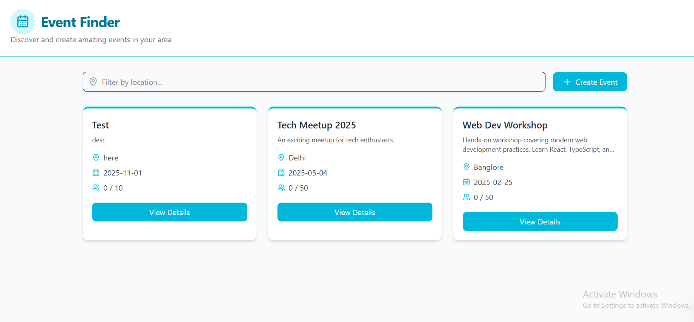
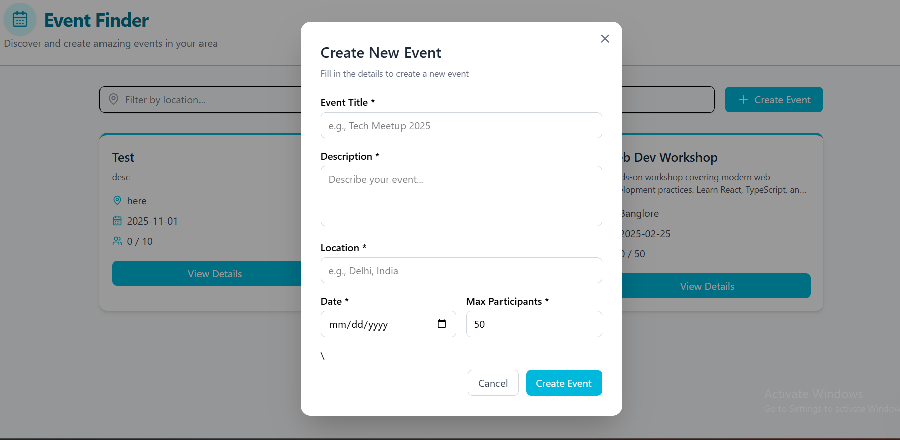
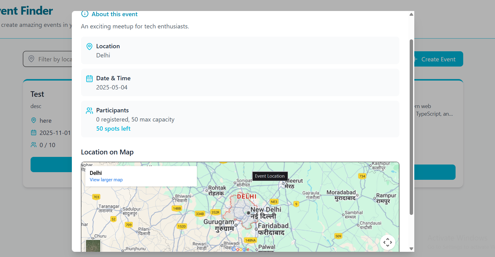

# Event Finder

A simple full-stack event listing app: Node/Express + MongoDB backend and a React + Vite TypeScript frontend.

This README covers setup, how to run the project (backend + frontend), environment variables, API endpoints, where to add screenshots/videos, and which AI tools were used to help build and document the project.

## Project overview

This project provides a minimal event management API and a UI to create/list events. It is intended as a small demo or starting point for an events app.

Project layout (top-level):

```
backend/
  server.js
  package.json
  controllers/
  routes/
  model/
  config/
frontend/
  package.json
  src/
    components/
    pages/
README.md
```

## Tech stack

- Backend: Node.js, Express, Mongoose (MongoDB)
- Frontend: React + Vite + TypeScript
- Dev tooling: nodemon for backend hot reload, Vite dev server for frontend

## Getting Started

First, clone the repository and install its dependencies:

```bash
# Clone the repository
git clone https://github.com/yash-bhargava20/Event-finder.git
cd Event-finder

# Install backend dependencies
cd backend
npm install
cd ..

# Install frontend dependencies
cd frontend
npm install
cd ..
```

## Prerequisites

- Node.js (v16/18+ recommended)
- npm
- MongoDB (Atlas or local)
- Git

## Environment variables

Create a `.env` file in the `backend/` directory with at least the following variables:

```
MONGO_URI=your_mongo_connection_string
PORT=5000 # optional, defaults to 5000
```

Notes:

- For a local DB: `mongodb://localhost:27017/event-finder`
- For Atlas: use your cluster connection string and replace credentials accordingly.

## Backend — install & run

Install and run the backend:

```bash
# from repository root
cd backend
npm install

# dev mode (nodemon):
npm run dev

# production (node):
npm start
```

By default the backend listens on port 5000. Confirm the server console shows `Server running on port 5000` and `MongoDB connected`.

### Useful backend tips

- Add temporary request logging in `server.js` if you want to see incoming requests:

```js
app.use((req, res, next) => {
  console.log(new Date().toISOString(), req.method, req.url);
  next();
});
```

## Frontend — install & run

Install and run the frontend:

```bash
cd frontend
npm install
npm run dev
```

Vite will start the dev server (commonly on port 5173). If the frontend is served on a different port than the backend, the frontend code must either call the backend by full URL (`http://localhost:5000/api/events`) or use a dev proxy.

To add a dev proxy so requests to `/api` forward to the backend, edit `frontend/vite.config.ts` and add a proxy entry:

```ts
// vite.config.ts (example)
export default defineConfig({
  server: {
    proxy: {
      "/api": "http://localhost:5000",
    },
  },
});
```

## API reference

Base URL: `http://localhost:5000/api/events`

- GET `/api/events` — returns an array of events
- POST `/api/events` — creates an event
  - Headers: `Content-Type: application/json`
  - Body example:

```json
{
  "title": "Community Picnic",
  "description": "Bring food and friends",
  "location": "Central Park",
  "date": "2025-11-01",
  "maxParticipants": 100
}
```

- DELETE `/api/events/:id` — deletes event with given id

Responses use standard HTTP status codes (200/201 on success, 4xx/5xx on error).

## Testing

Quick curl examples (backend running on 5000):

Create an event:

```bash
curl -i -X POST http://localhost:5000/api/events \
  -H "Content-Type: application/json" \
  -d '{"title":"Test","description":"desc","location":"here","date":"2025-11-01","maxParticipants":10}'
```

List events:

```bash
curl http://localhost:5000/api/events
```

If a request returns 404 or you get CORS errors, double-check you're targeting the backend port and path (e.g. `http://localhost:5000/api/events`) or set up the frontend proxy shown above.

## Demo & Screenshots

Watch a quick demo of the application in action:

https://github.com/yash-bhargava20/Event-finder/assets/demo/event-finder-demo.mp4

### Features shown in the demo:

1. Starting the backend server
2. Starting the frontend development server
3. Creating a new event
4. Viewing the event list
5. Viewing event details
6. Deleting an event

### Screenshots

### Homepage



### Create Event Form



### Event Details



To record your own demo:

1. Start both servers (backend on port 5000, frontend on port 5173)
2. Use Win+G (Windows) or Cmd+Shift+5 (macOS) to start screen recording
3. Demonstrate the key features above
4. Save the recording in `docs/video/demo.mp4`

## Which AI tools were used (and how)

This project README (and some code documentation) was created with assistance from AI coding/documentation tools to speed up writing and provide suggestions. Tools used during development and documentation may include:

- GitHub Copilot — used in the editor to suggest small code completions and repetitive boilerplate.
- ChatGPT / OpenAI — used to draft and refine documentation content and troubleshooting steps.

How they were used:

- Code suggestions: inline completions and quick snippets (via Copilot) while editing source files.
- Documentation: example prompts to the assistant included requests like: "Generate a README for a Node + React event finder app that includes setup, env vars, API examples, and screenshot instructions." The generated text was reviewed and adapted before committing.

If you want me to include the exact prompts used to generate parts of this README, or to re-run the generation with different wording, say so and I will append the prompts and the raw AI output to a `docs/ai-prompts.md` file.

## Contributing

PRs are welcome. Suggested small tasks:

- Add validation and tests for backend endpoints.
- Improve frontend forms and error handling.
- Add authentication and RSVP functionality.

## License

This repository currently has no license file. Add a `LICENSE` if you want to set an explicit license.
